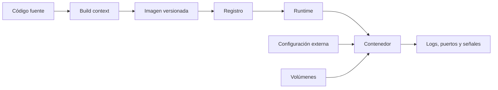

# Docker

> **Curso:** DevOps · **Capítulo:** 01 · **Prerequisitos:** fundamentos de línea de comandos y procesos
> **Código:** [`src/docker.rs`](../src/docker.rs) · **Video:** pendiente
> **Lección en el sitio:** pendiente

## Estado

`implemented`

## Introducción

Docker es la primera pieza operativa del curso porque convierte una aplicación
en un artefacto ejecutable con frontera clara. Antes de hablar de pipelines,
Kubernetes o despliegues progresivos, necesitamos saber qué estamos moviendo de
un ambiente a otro.

En este capítulo se estudia Docker como un contrato de ejecución reproducible:
imagen, contenedor, configuración, puertos, volúmenes, proceso principal y
límites de recursos. El lector debe conocer procesos, variables de entorno y
nociones básicas de red local.

## Motivación

La frase "en mi máquina sí funciona" no suele describir un misterio técnico.
Describe un contrato oculto. Quizá la laptop tenía una versión específica de
OpenSSL, un archivo `.env`, una dependencia instalada a mano, un directorio
temporal, permisos especiales o un comando que nunca llegó al README.

Docker no vuelve correcto a un sistema por sí mismo, pero obliga a declarar
parte de ese contrato. Una imagen dice qué filesystem, metadata y proceso se
esperan. Un contenedor dice cómo se ejecuta esa imagen en un ambiente concreto.
El trabajo de DevOps empieza cuando ese contrato deja de depender de memoria
humana.

## Teoría

### Historia

Los contenedores no nacieron con Docker. Unix ya tenía ideas de aislamiento de
procesos, y Linux agregó primitivas como namespaces y cgroups para separar
vistas del sistema y limitar recursos. Docker, publicado en 2013, hizo
accesible esa combinación con una experiencia simple: construir una imagen,
publicarla y ejecutarla de forma repetible.

La lección histórica no es "Docker inventó los contenedores". La lección es que
una buena herramienta puede convertir primitivas difíciles en una unidad de
trabajo entendible para equipos completos.

### Fundamentos

La unidad central es la relación entre tres piezas:

- **Imagen:** artefacto inmutable que empaqueta filesystem, metadata y punto de
  entrada.
- **Contenedor:** proceso aislado creado desde una imagen, con configuración de
  ejecución.
- **Registro:** lugar donde se publica y recupera la imagen que otros ambientes
  ejecutarán.

Una imagen debe tener tag explícito, proceso principal, usuario de ejecución,
puertos documentados y ausencia de secretos horneados. Un contenedor debe
declarar configuración de runtime, puertos publicados, montajes para datos
persistentes y límites de recursos cuando el ambiente lo requiera.

### Casos de uso

Docker es útil cuando se necesita:

- ejecutar el mismo servicio en desarrollo, CI y staging;
- publicar artefactos que un pipeline pueda promover;
- aislar dependencias de un servicio sin instalar todo en el host;
- probar integraciones locales con bases de datos, colas o cachés;
- preparar la unidad mínima que después orquestará Kubernetes.

### Ventajas y limitaciones

Docker mejora reproducibilidad, empaquetado y portabilidad. También reduce el
tiempo entre "compilé el servicio" y "puedo ejecutarlo en otro ambiente".

Pero tiene costos: una imagen mal construida puede ser pesada, insegura, lenta
de cachear o difícil de depurar. Un contenedor comparte kernel con el host; no
es una máquina virtual. Un tag como `latest` puede romper reproducibilidad. Un
secreto dentro de la imagen puede viajar a cada ambiente donde se publique.

### Comparación con alternativas

Ejecutar en el host es más simple, pero deja el ambiente demasiado implícito.
Las máquinas virtuales aíslan más, pero cargan un sistema operativo completo y
son más pesadas para ciclos rápidos. PaaS y serverless reducen operación
directa, pero esconden parte del contrato y aumentan dependencia del proveedor.

Docker ocupa un punto medio: suficiente estructura para declarar cómo corre un
servicio, sin convertir cada despliegue en administración completa de máquinas.

## Diagramas

El diagrama principal vive en
[`diagrams/01-docker.mmd`](../diagrams/01-docker.mmd). Resume el flujo:
fuente, build context, imagen, registro, contenedor y señales operativas.

## Análisis de complejidad

El capítulo no introduce un algoritmo con complejidad asintótica. El costo
relevante es operativo:

| Operación | Costo dominante | Qué lo afecta |
|-----------|-----------------|---------------|
| Build de imagen | tiempo de transferencia y cómputo | tamaño del contexto, cache de capas, instalación de dependencias |
| Pull de imagen | red y almacenamiento | tamaño comprimido, proximidad del registro, cache local |
| Arranque de contenedor | inicialización del proceso | entrypoint, carga de configuración, warming de aplicación |
| Investigación de falla | observabilidad disponible | logs, health checks, tags, metadata y trazabilidad |

La medición concreta se agregará en el cierre del milestone. Por ahora, el
modelo Rust permite discutir qué decisiones hacen más o menos operable el
contrato.

## Visualización interactiva (opcional)

No aplica en este bloque. Una visualización futura podría permitir activar o
desactivar invariantes del contrato y observar los hallazgos resultantes.

## Implementación

El código vive en [`src/docker.rs`](../src/docker.rs). El módulo representa:

- `ImageSpec`: imagen Docker/OCI como artefacto inmutable;
- `ContainerSpec`: contenedor como configuración de ejecución;
- `PortMapping`: puertos internos y publicados;
- `VolumeMount`: datos fuera del filesystem efímero;
- `validate_execution_contract`: revisión de invariantes operativas.

La implementación no invoca Docker. Eso es deliberado: el primer objetivo es
razonar sobre el contrato antes de automatizar comandos.

## Pruebas

Las pruebas unitarias cubren dos rutas:

- un contrato sano sin hallazgos;
- un contrato problemático con tag `latest`, root, entrypoint vacío, secreto
  horneado, puerto no declarado y ausencia de límite de memoria.

Los doctests de la API pública muestran el uso mínimo de `PortMapping` y
`validate_execution_contract`.

## Benchmarks

Pendiente del issue de mediciones del milestone `01. Docker`. La sección final
debe distinguir entre microbenchmarks de Rust y métricas operativas como tamaño
de imagen, tiempo de build, tiempo de pull o tiempo de arranque.

## Ejercicios

Pendiente del issue de ejercicios del milestone `01. Docker`.

## Soluciones

Pendiente del issue de ejercicios del milestone `01. Docker`.

## Referencias

- Open Container Initiative: Image Format Specification.
- Docker documentation: Dockerfile reference.
- Linux manual pages: namespaces and cgroups.
- Google SRE Workbook: prácticas de confiabilidad y señales operativas.
