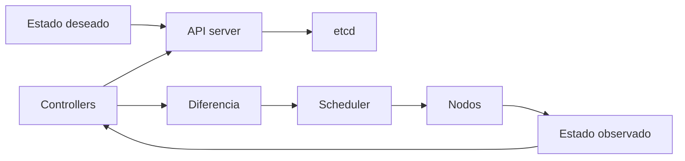

# Kubernetes

> **Curso:** DevOps · **Capítulo:** 02 · **Prerequisitos:** Docker
> **Código:** [`src/kubernetes.rs`](../src/kubernetes.rs) · **Video:** pendiente
> **Lección en el sitio:** pendiente

## Estado

`implemented`

## Introducción

Kubernetes aparece después de Docker porque no reemplaza el contrato de
ejecución: lo orquesta. Docker nos dio una imagen y un contenedor; Kubernetes
pregunta cómo mantener muchos contenedores vivos, conectados, configurados y
actualizados dentro de un cluster.

Este capítulo enseña Kubernetes como sistema de reconciliación de estado
deseado. El lector debe entender imágenes, contenedores, puertos, variables de
entorno y procesos antes de entrar aquí.

## Motivación

Un contenedor aislado no responde todas las preguntas de producción. Si el
proceso muere, alguien debe reiniciarlo. Si hay tres réplicas y una cae,
alguien debe crear otra. Si se despliega una versión nueva, alguien debe
reemplazar instancias sin cortar todo el tráfico. Si una réplica arrancó pero
todavía no está lista, alguien debe evitar mandarle requests.

Ese "alguien" no debería ser una persona recordando comandos a las dos de la
mañana. Kubernetes convierte esas tareas repetibles en loops de control que
observan el cluster y actúan para acercarlo al estado deseado.

## Teoría

### Historia

Kubernetes fue anunciado por Google en 2014 y se inspiró en años de operación
interna de sistemas de contenedores como Borg. Su valor no está en haber
inventado los contenedores, sino en popularizar un modelo declarativo para
operarlos: el equipo describe intención y el sistema intenta mantenerla.

La idea importante es vieja y poderosa: control loops. Un termostato compara
temperatura deseada contra temperatura real; Kubernetes compara estado deseado
contra estado observado.

### Fundamentos

El ciclo base es:

1. declarar intención en objetos;
2. persistir esa intención en el control plane;
3. observar el estado real del cluster;
4. detectar diferencia entre intención y realidad;
5. ejecutar acciones de reconciliación;
6. repetir.

Los objetos canónicos del capítulo son:

- **Pod:** unidad mínima de ejecución.
- **Deployment:** declara réplicas y estrategia de actualización.
- **Service:** da una dirección estable para llegar a pods cambiantes.
- **ConfigMap y Secret:** separan configuración de imagen.
- **Readiness y liveness probes:** distinguen "arrancó" de "puede recibir
  tráfico" y "quedó roto".
- **Requests y limits:** declaran necesidades y límites de recursos.

### Casos de uso

Kubernetes tiene sentido cuando un equipo necesita:

- operar varias réplicas de servicios;
- tolerar fallas de nodos o procesos;
- automatizar rollouts y rollbacks;
- descubrir servicios dentro de una red de cluster;
- aplicar configuración por ambiente;
- observar salud y capacidad de workloads;
- estandarizar operación entre equipos.

### Ventajas y limitaciones

Kubernetes ofrece una abstracción uniforme para operar workloads. Su modelo
declarativo permite automatizar trabajo que sería frágil en scripts manuales.

El costo es real: más conceptos, más piezas, más permisos, más superficie de
falla y más responsabilidad operativa. Para un servicio pequeño, una plataforma
PaaS o Docker Compose pueden ser mejores. Usar Kubernetes sin entenderlo no
elimina complejidad; la esconde hasta que producción la cobra.

### Comparación con alternativas

Docker Compose es excelente para desarrollo local y stacks chicos. Scripts con
SSH pueden ser suficientes al inicio, pero tienden a mezclar intención,
procedimiento y estado. PaaS reduce carga operativa, aunque limita control.

Kubernetes se justifica cuando el costo de operar manualmente supera el costo
de aprender y mantener el orquestador.

## Diagramas

El diagrama principal vive en
[`diagrams/02-kubernetes.mmd`](../diagrams/02-kubernetes.mmd).

## Análisis de complejidad

No hay complejidad asintótica útil para el estudiante en este capítulo. El
costo relevante es operativo:

| Operación | Costo dominante | Qué lo afecta |
|-----------|-----------------|---------------|
| Reconciliación | latencia de observación y acción | tamaño del cluster, controllers, eventos pendientes |
| Rollout | creación y readiness de réplicas | imagen, probes, capacidad disponible |
| Scheduling | búsqueda de nodo válido | requests, límites, afinidad, taints, presión de recursos |
| Diagnóstico | calidad de señales | eventos, logs, probes, métricas y cambios recientes |

El benchmark educativo de este curso medirá el costo del modelo Rust, no el
control plane real. Para producción importan métricas del cluster y de rollout.

## Visualización interactiva (opcional)

No aplica en este bloque. Una visualización futura puede mostrar réplicas
deseadas contra observadas y cómo un reconciliador decide escalar o esperar
readiness.

## Implementación

El código vive en [`src/kubernetes.rs`](../src/kubernetes.rs). El módulo
representa:

- `WorkloadSpec`: nombre, imagen, réplicas, puertos, probes y recursos;
- `ServiceSpec`: ruta estable hacia un workload;
- `ObservedWorkload`: estado observado del cluster;
- `ApplicationSpec`: workload más servicio;
- `reconcile`: comparación entre estado deseado y observado.

La implementación no intenta copiar la API completa de Kubernetes. Ese sería un
mal recurso educativo para este momento. El objetivo es hacer visible el ciclo
mental de reconciliación.

## Pruebas

Las pruebas unitarias cubren:

- una aplicación sana con una réplica faltante;
- una especificación insegura o incompleta: imagen `latest`, probes ausentes,
  recursos ausentes, service apuntando a otro workload y puerto no declarado.

Los doctests muestran cómo construir una aplicación mínima y obtener acciones
de reconciliación.

## Benchmarks

Pendiente del issue de mediciones del milestone `02. Kubernetes`. La medición
debe separar el costo del modelo educativo de las métricas reales: duración de
rollout, tiempo a readiness, eventos de scheduling y capacidad disponible.

## Ejercicios

Pendiente del issue de ejercicios del milestone `02. Kubernetes`.

## Soluciones

Pendiente del issue de ejercicios del milestone `02. Kubernetes`.

## Referencias

- Kubernetes documentation: Concepts.
- Kubernetes documentation: Workloads.
- Kubernetes documentation: Services, Load Balancing, and Networking.
- Kubernetes documentation: Configure Liveness, Readiness and Startup Probes.
- Google SRE Workbook: prácticas de rollout, observabilidad y respuesta.
