# Pipelines de CI/CD

> **Curso:** DevOps · **Capítulo:** 03 · **Prerequisitos:** Git, Docker
> **Código:** [`src/cicd.rs`](../src/cicd.rs) · **Video:** pendiente
> **Lección en el sitio:** pendiente

## Estado

`implemented`

## Introducción

Un pipeline de CI/CD es una cadena de evidencias antes de cambiar un sistema
vivo. Recibe un evento, ejecuta verificaciones, produce o valida un artefacto y
decide si el cambio puede avanzar hacia otro ambiente.

Este capítulo no enseña primero YAML. Enseña criterio: qué debe comprobarse,
qué debe bloquear, qué debe quedar registrado y cuándo una automatización se
vuelve ruido.

## Motivación

Un release manual parece barato mientras todo sale bien. El costo aparece
cuando alguien olvida correr una prueba, compila desde una rama equivocada,
despliega un artefacto distinto al revisado o no puede explicar qué commit está
vivo en producción.

CI/CD reduce ese riesgo al convertir pasos críticos en señales repetibles. Pero
un pipeline mal diseñado también puede ser peligroso: si es lento, el equipo lo
evade; si prueba lo incorrecto, da confianza falsa; si despliega sin gates,
automatiza el accidente.

La pregunta central no es "¿cómo hago deploy automático?". La pregunta es:
"¿qué evidencia necesito antes de permitir que este cambio avance?".

## Teoría

### Historia

La integración continua nació como una práctica para integrar cambios con
frecuencia y detectar errores temprano. La entrega continua extendió la idea:
si cada cambio puede producir un artefacto confiable, el equipo puede decidir
cuándo liberarlo con menos drama.

La evolución de herramientas llevó de servidores dedicados como Jenkins a
plataformas integradas con Git, runners efímeros, matrices de build, ambientes
protegidos y flujos GitOps. La herramienta importa, pero el principio dura más:
cada cambio debe producir evidencia antes de tocar producción.

### Fundamentos

Un pipeline útil declara:

- **Trigger:** qué evento lo activa: pull request, push, tag o promoción manual.
- **Stages:** etapas ordenadas o paralelizables: formato, lint, pruebas, build,
  seguridad, empaquetado y despliegue.
- **Gates:** condiciones obligatorias que bloquean avance.
- **Artifact:** unidad trazable que será promovida: binario, imagen, paquete o
  manifiesto.
- **Environment:** destino del cambio: development, staging o production.
- **Rollback:** salida documentada si el cambio degrada el sistema.

El pipeline sano separa tres decisiones:

1. **Verificar:** construir evidencia sobre el cambio.
2. **Empaquetar:** producir un artefacto reproducible.
3. **Promover:** mover ese artefacto entre ambientes con gates claros.

### Casos de uso

CI/CD tiene sentido cuando un equipo necesita:

- validar pull requests con señales consistentes;
- evitar builds hechos a mano desde laptops;
- publicar imágenes Docker con tag y commit trazable;
- promover el mismo artefacto entre staging y producción;
- bloquear releases si falla seguridad o pruebas críticas;
- auditar quién aprobó un cambio y cuándo;
- medir duración y confiabilidad del proceso de entrega.

### Ventajas y limitaciones

La ventaja principal es reducir variabilidad humana. Un pipeline también crea
historial, logs, permisos, evidencia y puntos claros de intervención.

El costo es diseño y mantenimiento. Un pipeline demasiado grande se vuelve
lento. Uno demasiado pequeño no protege. Uno demasiado acoplado a una
plataforma se vuelve difícil de migrar. Uno sin propiedad termina roto y nadie
lo siente como parte del producto.

### Comparación con alternativas

Un release manual puede bastar para un prototipo, pero no escala con equipo ni
riesgo. Scripts locales ayudan a repetir comandos, aunque no necesariamente
aportan revisión, permisos, historial o ambiente controlado. Una plataforma
PaaS puede ocultar buena parte del pipeline, pero el equipo sigue necesitando
entender qué evidencia exige antes de publicar.

CI/CD se justifica cuando el costo de olvidar pasos, perder trazabilidad o
romper ambientes supera el costo de mantener automatización.

## Diagramas

El diagrama principal vive en
[`diagrams/03-pipelines-de-cicd.mmd`](../diagrams/03-pipelines-de-cicd.mmd).

```mermaid
flowchart LR
    Change["Cambio en Git"] --> Trigger["Trigger"]
    Trigger --> Format["Formato"]
    Format --> Lint["Lint"]
    Lint --> Tests["Pruebas"]
    Tests --> Build["Build"]
    Build --> Security["Seguridad"]
    Security --> Package["Artefacto"]
    Package --> Staging["Staging"]
    Staging --> Approval["Aprobación"]
    Approval --> Production["Producción"]
    Production --> Signals["Señales y rollback"]
```

## Análisis de complejidad

No hay complejidad asintótica importante para el estudiante. El costo relevante
es operativo:

| Operación | Costo dominante | Qué lo afecta |
|-----------|-----------------|---------------|
| Validación de PR | duración de checks críticos | tamaño del proyecto, cache, paralelismo, dependencias |
| Build de artefacto | cómputo y transferencia | cache de capas, compilación incremental, registry |
| Promoción | latencia de ambiente y gates | aprobaciones, readiness, migraciones, capacidad |
| Diagnóstico | claridad de logs y eventos | naming de etapas, artifacts, retención, ownership |

Un pipeline rápido pero ciego es peligroso. Un pipeline completo pero lento
también. La disciplina está en construir la menor cadena de evidencia que
proteja el cambio real.

## Visualización interactiva (opcional)

No aplica en este bloque. Una visualización futura puede permitir activar
etapas, fallar gates y observar si el pipeline permite promoción a development,
staging o production.

## Implementación

El código vive en [`src/cicd.rs`](../src/cicd.rs). El módulo representa:

- `PipelineTrigger`: evento de entrada;
- `Environment`: ambiente destino;
- `StageKind`: tipo conceptual de etapa;
- `PipelineStage`: gate obligatorio u opcional con resultado;
- `BuildArtifact`: artefacto trazable por versión y commit;
- `PipelineSpec`: pipeline observado;
- `evaluate_pipeline`: evaluación de promoción.

La implementación no ejecuta comandos. Eso es deliberado: primero se enseña el
contrato mental del pipeline; después cada plataforma lo expresa con su sintaxis.

## Pruebas

Las pruebas unitarias cubren:

- un pipeline de pull request con gates mínimos;
- un pipeline de staging bloqueado por prueba fallida;
- un pipeline de producción incompleto: sin seguridad, paquete, aprobación,
  deploy, artefacto trazable ni rollback.

Los doctests muestran cómo construir una ruta mínima de validación para
development.

## Benchmarks

Pendiente del issue de mediciones del milestone `03. Pipelines de CI/CD`. La
medición debe distinguir entre el costo del modelo Rust y las métricas reales
de operación: duración del pipeline, tiempo de cola, cache hit rate, etapa más
lenta, tasa de fallos y tiempo de recuperación.

## Ejercicios

Pendiente del issue de ejercicios del milestone `03. Pipelines de CI/CD`.

## Soluciones

Pendiente del issue de ejercicios del milestone `03. Pipelines de CI/CD`.

## Referencias

- Continuous Integration, Martin Fowler.
- Continuous Delivery, Jez Humble y David Farley.
- GitHub Actions documentation: workflow syntax and environments.
- GitLab CI/CD documentation: pipelines and environments.
- Google SRE Workbook: release engineering.
