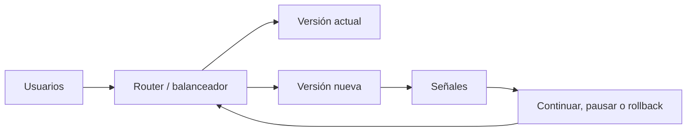

# Estrategias de Despliegue

> **Curso:** DevOps · **Capítulo:** 04 · **Prerequisitos:** Pipelines de CI/CD
> **Código:** [`src/deployment_strategies.rs`](../src/deployment_strategies.rs) · **Video:** pendiente
> **Lección en el sitio:** pendiente

## Estado

`implemented`

## Introducción

Una estrategia de despliegue controla exposición y reversibilidad cuando una
versión nueva entra a un sistema vivo. El objetivo no es hacer que el cambio
llegue rápido; el objetivo es que llegue con una forma clara de observar,
pausar, ampliar o revertir.

Este capítulo aparece después de CI/CD porque el pipeline puede construir un
artefacto confiable, pero todavía falta decidir cómo ponerlo frente a usuarios.

## Motivación

Un release puede pasar pruebas, compilar, producir imagen Docker y aun así
fallar cuando toca tráfico real. Quizá la latencia sube solo con ciertos datos,
una migración rompe compatibilidad temporal, una nueva ruta genera más errores
o una dependencia externa responde diferente.

La estrategia de despliegue limita cuánto daño puede hacer esa incertidumbre.
Un deploy sano convierte riesgo absoluto en exposición gradual con señales.

## Teoría

### Historia

Durante años, muchos equipos hicieron despliegues tipo big bang: ventana de
mantenimiento, cambio grande, todos atentos y rollback manual si algo fallaba.
Ese modelo sigue existiendo, pero los sistemas modernos suelen exigir cambios
más frecuentes, menos interrupciones y recuperación más rápida.

Prácticas como rolling updates, blue-green, canary releases y feature flags
nacieron para separar publicar código, exponer tráfico y activar funcionalidad.
El patrón común es reducir blast radius.

### Fundamentos

Toda estrategia debe responder:

- **Qué versión entra:** artefacto, tag, commit o release.
- **Quién la ve:** porcentaje de tráfico, segmento, región o ambiente.
- **Qué se observa:** errores, latencia, reinicios y métricas de negocio.
- **Cuándo avanza:** criterios de promoción.
- **Cuándo se pausa:** señales que requieren investigación.
- **Cuándo revierte:** señales que hacen inaceptable continuar.
- **Qué convive:** compatibilidad entre versión vieja y nueva.

El capítulo compara cinco estrategias:

- **Big bang:** todo cambia al mismo tiempo.
- **Rolling:** se reemplazan instancias gradualmente.
- **Blue-green:** dos ambientes alternan tráfico.
- **Canary:** una fracción pequeña recibe la versión nueva.
- **Feature flags:** se despliega código sin activar toda la funcionalidad.

### Casos de uso

Rolling updates sirven cuando el servicio tolera convivencia de versiones y no
se necesita duplicar ambientes. Blue-green funciona bien cuando el cambio de
tráfico debe ser rápido y el costo de duplicar infraestructura es aceptable.
Canary ayuda cuando se quiere observar tráfico real con bajo impacto. Feature
flags son útiles para separar despliegue técnico de activación de producto.

Big bang puede ser aceptable en sistemas pequeños o cambios de bajo riesgo,
pero debe reconocerse como máximo blast radius.

### Ventajas y limitaciones

Las estrategias progresivas reducen impacto inicial y mejoran aprendizaje
operativo. También obligan a tener señales de salud reales; sin métricas, un
canary es solo una espera decorada.

El costo es complejidad: routing, compatibilidad temporal, flags pendientes,
ambientes duplicados, criterios de promoción y disciplina de rollback. Una
estrategia elegante sin ownership termina siendo teatro operacional.

### Comparación con alternativas

Un pipeline sin estrategia solo responde "¿el artefacto parece válido?". Una
estrategia responde "¿cómo lo exponemos sin apostar todo?". Un orquestador como
Kubernetes puede ejecutar rolling updates, pero no decide por sí solo si las
señales significan continuar o revertir. Un feature flag puede proteger
activación de producto, pero no reemplaza pruebas, artefactos trazables ni
observabilidad.

## Diagramas

El diagrama principal vive en
[`diagrams/04-estrategias-de-despliegue.mmd`](../diagrams/04-estrategias-de-despliegue.mmd).

## Análisis de complejidad

No hay complejidad asintótica relevante. El costo es operativo:

| Estrategia | Costo dominante | Riesgo principal |
|------------|-----------------|------------------|
| Big bang | coordinación y rollback | impacto total si falla |
| Rolling | convivencia de versiones | incompatibilidad temporal |
| Blue-green | infraestructura duplicada | datos compartidos y corte de tráfico |
| Canary | observabilidad y routing | señales insuficientes |
| Feature flags | gestión de flags | deuda de activaciones viejas |

La complejidad real aparece cuando los datos migran, los contratos cambian o
las señales no distinguen bien entre ruido y degradación.

## Visualización interactiva (opcional)

No aplica en este bloque. Una visualización futura puede permitir mover un
slider de exposición y observar cómo cambian riesgo, decisión y hallazgos para
cada estrategia.

## Implementación

El código vive en
[`src/deployment_strategies.rs`](../src/deployment_strategies.rs). El módulo
representa:

- `DeploymentStrategyKind`: big bang, rolling, blue-green, canary y feature
  flag;
- `DeploymentStrategy`: release, exposición, señales, rollback y compatibilidad;
- `HealthSignal`: señales mínimas para decidir;
- `DeploymentFinding`: riesgos detectados;
- `evaluate_deployment`: decisión `Continue`, `Pause` o `RollBack`.

La implementación no opera infraestructura real. Eso es deliberado: primero se
razona la estrategia, después se expresa en Kubernetes, un balanceador, una
plataforma cloud o un sistema de flags.

## Pruebas

Las pruebas unitarias cubren:

- canary sano con señales, rollback y compatibilidad;
- rolling update con exposición inicial excesiva y guardrails faltantes;
- big bang con exposición total y sin señales suficientes.

Los doctests muestran cómo construir una estrategia canary mínima y evaluarla.

## Benchmarks

Pendiente del issue de mediciones del milestone `04. Estrategias de despliegue`.
La medición debe distinguir el costo del modelo Rust de métricas reales:
duración del rollout, tiempo de detección, tiempo de rollback, porcentaje de
tráfico expuesto y tasa de error durante la promoción.

## Ejercicios

Pendiente del issue de ejercicios del milestone `04. Estrategias de despliegue`.

## Soluciones

Pendiente del issue de ejercicios del milestone `04. Estrategias de despliegue`.

## Referencias

- Martin Fowler: Blue-Green Deployment.
- Martin Fowler: Canary Release.
- LaunchDarkly: feature flags and progressive delivery.
- Kubernetes documentation: Deployments and rolling updates.
- Google SRE Workbook: release engineering and rollback practices.
