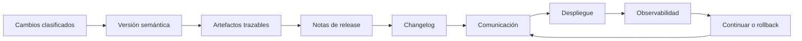

# Gestión de releases

> **Curso:** DevOps · **Capítulo:** 05 · **Prerrequisitos:** Pipelines de CI/CD
> **Código:** [`src/release_management.rs`](../src/release_management.rs) · **Video:** pendiente
> **Lección en el sitio:** pendiente

## Estado

`implemented`

## Introducción

Gestionar releases es convertir cambios técnicos en versiones entendibles,
trazables y comunicables. Un release no es solo un tag ni el resultado
automático de un pipeline; es una decisión de publicación con versión, alcance,
compatibilidad, artefactos, notas, changelog, rollback y canales de
comunicación.

Este capítulo aparece después de estrategias de despliegue porque desplegar una
versión no es lo mismo que gestionarla. La estrategia decide cómo exponer una
versión a usuarios. Release management decide qué identidad tiene esa versión,
qué promete a sus consumidores y qué evidencia deja para operar el sistema
después.

## Motivación

Un equipo puede tener buen código, pruebas verdes, imagen Docker publicada y un
despliegue canary bien armado, pero aun así fallar en una pregunta básica:
"¿qué versión está corriendo y qué cambio introdujo este comportamiento?".

Cuando la respuesta vive repartida entre commits, mensajes de chat, tags
manuales y memoria humana, cada incidente se vuelve más lento. Nadie sabe si el
cambio era compatible, si había migración, qué artefacto salió del pipeline, a
quién se avisó o cuál era la última versión segura.

Release management reduce esa ambigüedad. Su trabajo no es burocracia: es
memoria operativa verificable.

## Teoría

### Historia

Antes de que el despliegue continuo se volviera común, muchos equipos
publicaban versiones grandes en ventanas de mantenimiento. El release era un
evento: se armaba una lista de cambios, se coordinaban responsables, se
notificaba a usuarios y se preparaba un plan de regreso.

Con CI/CD, contenedores y plataformas cloud, publicar se volvió mucho más
frecuente. Eso trajo una tentación peligrosa: confundir "podemos desplegar cada
merge" con "cada merge ya es un release bien gestionado".

La práctica moderna intenta quedarse con lo mejor de ambos mundos: frecuencia y
automatización, pero sin perder identidad, compatibilidad, comunicación ni
trazabilidad.

### Fundamentos

Un release sano debe responder:

- **Qué cambia:** fixes, features, breaking changes y migraciones.
- **Qué versión entra:** versión semántica, tag o identificador estable.
- **Qué artefactos se publican:** binario, imagen, paquete, chart o
  manifiesto.
- **De dónde salieron:** commit, digest, build o pipeline trazable.
- **Qué compatibilidad promete:** patch, minor o major.
- **Cómo se informa:** notas de release, changelog y canal de comunicación.
- **Cómo se revierte:** versión segura, rollback técnico o mitigación.
- **Quién aprueba:** criterio humano o automatizado antes de publicar.

La unidad mental del capítulo es:

1. agrupar cambios que forman una versión;
2. clasificar el impacto;
3. decidir el incremento de versión;
4. producir artefactos y tags trazables;
5. comunicar qué cambió y quién queda afectado;
6. conservar una salida si el release degrada el sistema.

Un release bien gestionado permite que otros equipos entiendan qué ocurrió sin
leer todo el diff.

### Semantic Versioning

Semantic Versioning usa tres posiciones: `MAJOR.MINOR.PATCH`.

- `PATCH` comunica correcciones compatibles.
- `MINOR` comunica funcionalidad compatible.
- `MAJOR` comunica cambio incompatible para consumidores existentes.

La versión no es decoración; es lenguaje de contrato. Si un cambio rompe
compatibilidad y se publica como minor, el número miente. Esa mentira técnica
termina costando soporte, confianza y tiempo de diagnóstico.

### Changelog y notas de release

El changelog es memoria acumulativa. Sirve para reconstruir la historia del
producto o servicio.

Las notas de release son comunicación situada. Sirven para explicar una versión
específica: qué incluye, por qué importa, qué riesgos tiene, qué migraciones
requiere y qué debe observar quien la consume.

Un changelog sin criterio se vuelve relleno. Unas notas de release escritas al
final, sin mirar impacto real, se vuelven una plantilla vacía. La disciplina
está en escribir para la persona que tendrá que usar, operar o reparar el
sistema.

### Artefactos trazables

Un release debe poder conectarse con lo que realmente se publicó. En la práctica
eso puede ser:

- una imagen Docker con digest;
- un binario con hash;
- un paquete publicado;
- un chart de Kubernetes;
- un manifiesto firmado;
- un tag asociado a un commit.

La pregunta importante no es "¿existe un artefacto?", sino "¿podemos demostrar
que este artefacto salió de este cambio y corresponde a esta versión?".

### Casos de uso

En una librería, release management protege consumidores que actualizan por
versión. En una API, ayuda a comunicar contratos, migraciones y deprecaciones.
En una aplicación interna, reduce confusión operativa cuando soporte pregunta
qué versión tiene un cliente. En una plataforma regulada, deja evidencia para
auditoría, aprobación y trazabilidad.

En todos los casos, el release es el puente entre código y operación.

### Ventajas y limitaciones

La ventaja principal es claridad. El equipo sabe qué cambió, qué versión lo
contiene, qué artefacto se publicó, qué riesgo existe y cómo regresar.

También mejora colaboración: producto entiende qué salió, soporte sabe qué
comunicar, operaciones sabe qué monitorear y otros equipos saben si pueden
actualizar.

La limitación es que no se puede automatizar todo el criterio. Las herramientas
pueden sugerir versiones, generar changelogs o publicar tags, pero no siempre
entienden compatibilidad de negocio, contratos implícitos o migraciones
delicadas.

### Comparación con alternativas

Publicar sin versionar es suficiente para experimentos locales o prototipos,
pero no para sistemas vivos. Tags manuales agregan puntos de referencia, aunque
pueden quedarse sin notas, criterio o trazabilidad. Release trains dan cadencia
predecible, pero pueden acumular riesgo si los cambios esperan demasiado.

La decisión de este capítulo es usar release management como contrato
operativo: una versión debe tener identidad, evidencia, comunicación y salida.

## Diagramas

El diagrama principal vive en
[`diagrams/05-gestion-de-releases.mmd`](../diagrams/05-gestion-de-releases.mmd).



## Análisis de complejidad

No hay complejidad asintótica relevante para el modelo educativo. El costo real
es organizacional y operativo:

| Área | Costo dominante | Riesgo principal |
|------|-----------------|------------------|
| Versionado | clasificar impacto | versión que no comunica compatibilidad |
| Changelog | mantener historia útil | texto mecánico sin información accionable |
| Artefactos | trazabilidad build-commit | publicar algo que no se puede reconstruir |
| Comunicación | audiencia y canal | consumidores sorprendidos por el cambio |
| Rollback | versión segura y datos | no poder regresar aunque exista tag |

La complejidad crece cuando hay múltiples servicios, datos migrados, clientes
con versiones distintas o contratos públicos.

## Visualización interactiva (opcional)

No aplica en este bloque. Una visualización futura puede permitir marcar tipos
de cambio y observar cómo cambia el bump esperado, los hallazgos y la
preparación del release.

## Implementación

El código vive en
[`src/release_management.rs`](../src/release_management.rs). El módulo
representa:

- `SemanticVersion`: versión `major.minor.patch`;
- `VersionBump`: incremento esperado;
- `ChangeKind`: fix, feature, breaking change y migración;
- `ReleaseArtifact`: artefacto con nombre, commit y referencia;
- `ReleasePlan`: versión previa, versión nueva, cambios, artefactos,
  changelog, notas, rollback y comunicación;
- `ReleaseFinding`: hallazgos de riesgo;
- `evaluate_release`: evaluación de preparación del release.

La implementación no publica tags, no genera changelogs reales y no interactúa
con GitHub Releases. Eso es deliberado: primero se aprende a razonar el
contrato de release, después se automatiza con herramientas concretas.

## Pruebas

Las pruebas unitarias cubren:

- release minor bien documentado;
- breaking change publicado incorrectamente como minor;
- release sin avance de versión, sin comunicación y con artefacto no trazable.

Los doctests muestran cómo construir un release compatible y evaluarlo.

## Ejemplo

El ejemplo ejecutable vive en
[`examples/release_management.rs`](../examples/release_management.rs):

```bash
cargo run --example release_management
```

El ejemplo compara un release minor correcto contra un release riesgoso con
breaking change mal versionado.

## Benchmarks

Pendiente para el siguiente issue del milestone `05. Gestión de releases`.

Las mediciones educativas deberán evaluar el costo de revisar releases
representativos: uno sano, uno con versión incorrecta y uno sin trazabilidad ni
comunicación.

## Ejercicios

Pendiente para el siguiente issue del milestone `05. Gestión de releases`.

Los ejercicios deberán cubrir al menos:

- construir un release minor compatible;
- detectar una versión semántica incorrecta;
- endurecer un release sin trazabilidad;
- diseñar un caso real con notas, changelog, artefactos y rollback.

## Soluciones

Pendiente para el siguiente issue del milestone `05. Gestión de releases`.

## Referencias

- Semantic Versioning.
- Keep a Changelog.
- Google SRE Workbook: release engineering.
- Kubernetes documentation: Deployments and rollbacks.
- GitHub Docs: Releases and tags.
