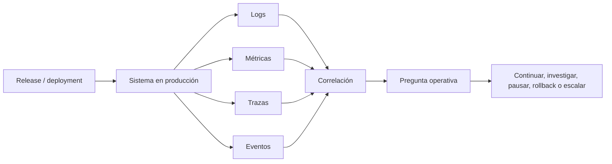

# Observabilidad

> **Curso:** DevOps · **Capítulo:** 06 · **Prerrequisitos:** sistemas distribuidos y despliegues
> **Código:** [`src/observability.rs`](../src/observability.rs) · **Video:** pendiente
> **Lección en el sitio:** pendiente

## Estado

`implemented`

## Introducción

Observabilidad es la capacidad de entender el estado interno de un sistema a
partir de sus señales externas. En DevOps, no basta con que un servicio compile,
pase pruebas, genere artefactos y se despliegue. También debe poder explicar
qué está pasando cuando recibe tráfico real.

Este capítulo aparece después de gestión de releases porque una versión
publicada debe poder observarse. Release management responde "qué cambió";
observabilidad responde "qué está ocurriendo después del cambio".

## Motivación

Cuando producción falla, el código fuente no basta. El equipo necesita señales
que permitan reconstruir qué pasó, dónde pasó, a quién afectó y qué cambió
antes del incidente.

El problema real aparece cuando el sistema tiene "datos" pero no tiene
observabilidad. Hay logs sin estructura, métricas sin dueño, dashboards que no
responden preguntas y trazas que no cruzan fronteras importantes. En ese
contexto, cada incidente se diagnostica por intuición, búsqueda manual o
conocimiento tribal.

Observabilidad reduce esa ceguera operativa. Su trabajo no es llenar pantallas:
es producir evidencia suficiente para tomar decisiones.

## Teoría

### Historia

Durante mucho tiempo, operar software significó revisar logs en servidores,
vigilar CPU y memoria, y esperar que alguien conociera el sistema lo bastante
bien para interpretar síntomas. Ese enfoque funcionaba mejor cuando las
aplicaciones eran monolitos pequeños y el tráfico era relativamente simple.

Los sistemas modernos cambiaron la forma del problema. Una petición puede pasar
por varios servicios, colas, bases de datos, proveedores externos y regiones.
Una degradación puede afectar solo a una versión, un segmento de usuarios o una
ruta poco frecuente. En ese contexto, ver "el servidor está arriba" ya no basta.

La observabilidad moderna nace de esa necesidad: conservar contexto mientras el
sistema ejecuta trabajo real.

### Fundamentos

La unidad mental del capítulo es:

1. emitir eventos relevantes;
2. medir comportamiento agregado;
3. seguir una petición entre componentes;
4. correlacionar señales con cambios recientes;
5. convertir evidencia en una decisión operativa.

Logs, métricas y trazas no compiten entre sí. Cada señal responde una pregunta
distinta y juntas permiten leer un sistema vivo sin depender de adivinanzas.

### Logs

Un log registra que algo ocurrió. Puede ayudar a responder "qué pasó" y "con
qué contexto". Un log útil suele incluir servicio, ambiente, versión, operación,
resultado, identificador de correlación y campos estructurados.

Un log pobre dice "error". Un log útil dice qué operación falló, en qué versión,
para qué petición y con qué causa observable.

### Métricas

Una métrica resume comportamiento en el tiempo. Ayuda a responder "cuánto",
"con qué frecuencia" y "desde cuándo". Errores, latencia, throughput, saturación
y colas suelen expresarse como métricas.

La trampa de las métricas es la cardinalidad. Etiquetar cada métrica con valores
ilimitados, como usuario individual o request id, puede volver caro o inestable
el sistema de observabilidad.

### Trazas

Una traza sigue una petición entre componentes. Ayuda a responder "dónde se fue
el tiempo" y "qué dependencia participó". En sistemas distribuidos, una traza
permite ver causalidad entre servicios, no solo síntomas aislados.

Una traza sin propagación de contexto se corta justo donde más se necesita.

### Eventos

Un evento representa algo significativo para el dominio o para la operación:
orden creada, pago rechazado, feature flag activada, rollout pausado,
migración iniciada. Los eventos ayudan a conectar comportamiento técnico con
impacto de negocio.

No todo evento debe alertar. Algunos existen para reconstruir historia y
correlacionar decisiones.

### Preguntas operativas

La observabilidad empieza con una pregunta, no con una herramienta:

- ¿La versión nueva está sana?
- ¿Qué usuario o segmento quedó afectado?
- ¿Dónde subió la latencia?
- ¿Qué cambió antes del incidente?
- ¿Debemos continuar, pausar, revertir o escalar?

Si una señal no ayuda a responder una pregunta ni habilita una acción, quizá
solo está agregando ruido y costo.

### Casos de uso

En un canary release, observabilidad permite comparar la versión nueva contra la
estable antes de ampliar tráfico. En un incidente, permite reconstruir una línea
de tiempo sin depender de memoria humana. En una API pública, ayuda a detectar
errores por consumidor, endpoint o versión. En sistemas regulados, sostiene
auditoría y explicación posterior.

### Ventajas y limitaciones

La ventaja principal es velocidad de aprendizaje. Un equipo observable puede
pasar de síntoma a hipótesis y de hipótesis a acción con menos fricción.

También mejora diseño: cuando sabes qué preguntas necesitas responder, tiendes a
construir servicios con mejor contexto, mejores errores y límites más claros.

La limitación es que observabilidad no arregla el sistema por sí sola. Puede
mostrar degradación, pero alguien debe decidir qué significa y qué acción tomar.
Tampoco conviene medir todo: telemetría sin propósito consume dinero, atención y
tiempo.

### Comparación con alternativas

Logs sueltos son suficientes al inicio, pero no sostienen diagnóstico complejo.
Métricas aisladas muestran síntomas, pero no siempre causas. Dashboards manuales
pueden ayudar, aunque se vuelven decoración si no nacen de preguntas. Trazas
distribuidas explican recorridos, pero exigen instrumentación consistente.

La decisión de este capítulo es tratar observabilidad como contrato operativo:
una señal debe tener contexto, calidad, retención y acción asociada.

## Diagramas

El diagrama principal vive en
[`diagrams/06-observabilidad.mmd`](../diagrams/06-observabilidad.mmd).



## Análisis de complejidad

No hay complejidad asintótica relevante para el modelo educativo. El costo real
es volumen, cardinalidad, retención y atención humana:

| Señal | Costo dominante | Riesgo principal |
|-------|-----------------|------------------|
| Logs | volumen y búsqueda | texto sin estructura |
| Métricas | cardinalidad y retención | etiquetas ilimitadas |
| Trazas | muestreo y propagación | contexto incompleto |
| Eventos | diseño semántico | ruido de eventos irrelevantes |
| Dashboards | mantenimiento | pantallas que no responden preguntas |

La complejidad aumenta cuando hay muchos servicios, múltiples versiones,
ambientes mezclados, alta cardinalidad o retención larga por cumplimiento.

## Visualización interactiva (opcional)

No aplica en este bloque. Una visualización futura puede permitir activar o
desactivar logs, métricas y trazas para observar qué preguntas quedan sin
respuesta.

## Implementación

El código vive en [`src/observability.rs`](../src/observability.rs). El módulo
representa:

- `OperationalQuestion`: pregunta que el sistema debe responder;
- `SignalKind`: log, métrica, traza o evento;
- `OperationalAction`: continuar, investigar, pausar, rollback o escalar;
- `TelemetrySignal`: señal con servicio, ambiente, versión, correlación,
  estructura, retención, cardinalidad y acción;
- `ObservabilityPlan`: conjunto de señales para una pregunta;
- `ObservabilityFinding`: hallazgos de ceguera operativa;
- `evaluate_observability`: evaluación de cobertura observable.

La implementación no integra OpenTelemetry, Prometheus, Grafana ni un backend
real. Eso es deliberado: primero se aprende a razonar qué señal necesita el
equipo, después se instrumenta con herramientas concretas.

## Pruebas

Las pruebas unitarias cubren:

- plan completo para evaluar salud de release;
- plan con señales centrales faltantes y contexto incompleto;
- métrica con cardinalidad riesgosa.

Los doctests muestran cómo construir una señal y cómo evaluar un plan completo.

## Ejemplo

El ejemplo ejecutable vive en
[`examples/observability.rs`](../examples/observability.rs):

```bash
cargo run --example observability
```

El ejemplo compara un plan observable para una versión nueva contra un plan con
log suelto, sin métricas, sin trazas y sin contexto suficiente.

## Benchmarks

Pendiente para el siguiente issue del milestone `06. Observabilidad`.

Las mediciones educativas deberán evaluar el costo de revisar planes de
observabilidad representativos: uno completo, uno incompleto y uno con
cardinalidad riesgosa.

## Ejercicios

Pendiente para el siguiente issue del milestone `06. Observabilidad`.

Los ejercicios deberán cubrir al menos:

- construir un plan observable para salud de release;
- detectar logs sin estructura y señales sin contexto;
- corregir una métrica con cardinalidad riesgosa;
- diseñar un caso real con pregunta, señales, contexto, retención y acción.

## Soluciones

Pendiente para el siguiente issue del milestone `06. Observabilidad`.

## Referencias

- Charity Majors, Liz Fong-Jones y George Miranda: Observability Engineering.
- OpenTelemetry documentation: traces, metrics and logs.
- Google SRE Book: monitoring distributed systems.
- Prometheus documentation: metric types and labels.
- Grafana documentation: dashboards and alerting.
