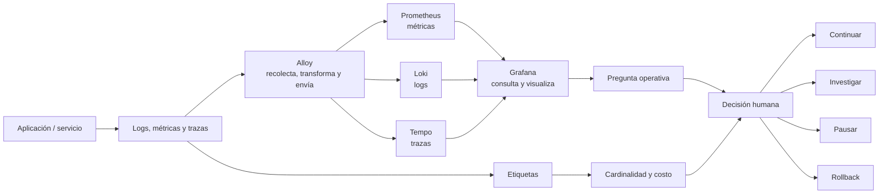

# Stack Grafana

> **Curso:** DevOps · **Capítulo:** 07 · **Prerrequisitos:** Observabilidad
> **Código:** [`src/grafana_stack.rs`](../src/grafana_stack.rs) · **Video:** pendiente
> **Lección en el sitio:** pendiente

## Estado

`benchmarked`

## Intención

Este capítulo aterrizará observabilidad en el stack Grafana: Grafana,
Prometheus, Loki, Tempo y Alloy, explicando el papel de cada pieza.

Stack Grafana no se estudia como una lista de productos. Se estudia como una
tubería operativa: un sistema emite señales, un agente las recolecta, un backend
las almacena con límites explícitos, una interfaz las consulta y una persona
toma una decisión.

El criterio central del capítulo es sencillo: una herramienta de observabilidad
vale si ayuda a responder una pregunta operativa con evidencia suficiente. Si
solo agrega pantallas, ruido o costo, no está observando el sistema; está
decorándolo.

## Problema

Nombrar herramientas no enseña observabilidad. El valor aparece cuando cada
componente se entiende como parte de una tubería de señales: capturar, etiquetar,
almacenar, consultar, correlacionar y visualizar.

El problema real aparece cuando el equipo ya decidió observar el sistema, pero
no sabe cómo conectar las piezas. Prometheus puede recolectar métricas, Loki
puede almacenar logs, Tempo puede conservar trazas, Alloy puede transportar
señales y Grafana puede consultar todo. Aun así, el resultado puede ser pobre:
dashboards que nadie usa, etiquetas de alta cardinalidad, logs imposibles de
buscar, trazas incompletas y costos de retención que crecen sin una pregunta
clara.

El stack no resuelve automáticamente la disciplina. Solo ofrece piezas. La
ingeniería está en decidir qué señal entra, con qué etiquetas, por cuánto
tiempo, para qué pregunta y con qué acción esperada.

## Concepto

Stack Grafana es una familia de herramientas que permite construir una ruta de
telemetría completa:

- **Alloy** recolecta, transforma y envía señales desde aplicaciones,
  servidores, contenedores o clústeres.
- **Prometheus** modela métricas como series temporales consultables.
- **Loki** modela logs como flujos etiquetados, evitando indexar cada palabra
  como si fuera un motor de búsqueda general.
- **Tempo** modela trazas distribuidas para seguir una petición entre
  componentes.
- **Grafana** consulta y visualiza las señales para responder preguntas
  operativas.

La idea importante no es memorizar nombres. La idea es entender la frontera de
cada componente: quién recolecta, quién almacena, quién consulta, quién
correlaciona y quién decide.

## Alternativas

Un equipo puede observar un sistema con varias familias de soluciones:

| Alternativa | Ventaja | Riesgo |
|-------------|---------|--------|
| Logs centralizados simples | Fácil de iniciar y suficiente para sistemas pequeños. | Se vuelve lento y caro si intenta responder todo solo con texto. |
| Métricas aisladas | Buen resumen temporal de salud y saturación. | Puede esconder causas si no se correlaciona con logs, trazas y cambios. |
| APM comercial administrado | Reduce operación del backend de observabilidad. | Puede ocultar costos, retención, muestreo y dependencia de proveedor. |
| OpenTelemetry con backend mixto | Da portabilidad conceptual y técnica. | Requiere disciplina para no producir telemetría sin propósito. |
| Stack Grafana | Integra métricas, logs, trazas y visualización con piezas explícitas. | Exige diseñar etiquetas, retención, consultas y dashboards con intención. |

Este capítulo usa Stack Grafana porque permite ver la tubería completa sin
ocultar las decisiones. No afirma que siempre sea la mejor solución. En equipos
pequeños, una plataforma administrada puede ser más prudente. En dominios
regulados, la retención, soberanía de datos y auditoría pueden pesar más que la
comodidad.

## Tradeoffs

El primer tradeoff es control contra operación. Ejecutar piezas propias da más
control sobre retención, etiquetas y costos, pero también agrega mantenimiento.
Consumir una plataforma administrada reduce operación, aunque puede volver
opacas algunas decisiones.

El segundo tradeoff es detalle contra costo. Más etiquetas, más trazas y más
logs pueden mejorar diagnóstico, pero también aumentan cardinalidad, volumen y
tiempo de búsqueda. La pregunta no es "¿podemos guardar más?", sino "¿qué
evidencia necesitamos para decidir mejor?".

El tercer tradeoff es cobertura contra ruido. Un dashboard con cincuenta
paneles no necesariamente informa mejor que uno con cinco señales accionables.
Un stack maduro separa exploración, monitoreo continuo, investigación de
incidentes y auditoría posterior.

## Invariantes

Una ruta de telemetría dentro del stack debe conservar estas invariantes:

- cada señal tiene dueño, servicio, ambiente y propósito visible;
- ninguna etiqueta tiene cardinalidad ilimitada por accidente;
- los logs conservan contexto suficiente sin convertirse en base de datos de
  negocio;
- las métricas responden preguntas agregadas y no sustituyen trazas;
- las trazas cruzan las fronteras importantes del flujo;
- la retención se decide por investigación, auditoría y costo, no por inercia;
- un dashboard debe responder una pregunta operativa concreta;
- una alerta no debe existir si nadie sabe qué acción tomar.

## Fronteras con cursos vecinos

`rust-cloud` enseña dónde corren los sistemas y qué servicios de plataforma
existen. Este capítulo no repite VPC, IAM, cómputo ni almacenamiento cloud,
salvo cuando ayudan a entender costo o despliegue de telemetría.

`rust-software-architecture` enseña cómo se organizan límites, componentes y
dependencias. Este capítulo asume esos límites y pregunta qué señales deben
cruzarlos para hacer el sistema operable.

El capítulo anterior, Observabilidad, define la disciplina: preguntas,
señales, contexto y acciones. Stack Grafana aterriza esa disciplina en una
tubería concreta.

SRE profundiza en objetivos de confiabilidad, error budgets y respuesta a
incidentes. Este capítulo prepara la infraestructura conceptual para ese
trabajo, pero no sustituye el diseño de SLOs ni el proceso humano de guardias.

## Diagrama

El diagrama principal vive en
[`diagrams/07-stack-grafana.mmd`](../diagrams/07-stack-grafana.mmd).



La ruta es deliberadamente simple: el servicio emite señales, Alloy las
recolecta y las envía al backend correspondiente. Grafana no es el almacén de
todo; es la interfaz donde se consultan y correlacionan las señales para tomar
una decisión.

## Cómo leer el stack

El stack tiene cinco responsabilidades:

1. **Emitir:** el sistema produce señales con contexto suficiente.
2. **Recolectar:** Alloy toma señales desde procesos, contenedores o clústeres.
3. **Almacenar:** Prometheus, Loki y Tempo conservan tipos distintos de señal.
4. **Consultar:** Grafana permite explorar, visualizar y correlacionar.
5. **Decidir:** una persona usa la evidencia para continuar, investigar,
   pausar o revertir.

La confusión común es pensar que Grafana "hace observabilidad". Grafana ayuda a
consultar y visualizar, pero la observabilidad nace antes: en qué señal emite el
servicio, con qué etiquetas, qué retención tiene, cómo se correlaciona y qué
pregunta responde.

## Implementación

El código vive en [`src/grafana_stack.rs`](../src/grafana_stack.rs). El módulo
representa:

- `TelemetrySignalKind`: métrica, log o traza;
- `GrafanaComponent`: Alloy, Prometheus, Loki, Tempo y Grafana;
- `LabelCardinality`: cardinalidad baja, acotada o ilimitada;
- `TelemetryLabel`: etiqueta asociada a una señal;
- `TelemetryRoute`: ruta completa desde productor hasta visualización;
- `GrafanaStackFinding`: hallazgos de diseño de la ruta;
- `evaluate_route`: evaluación de coherencia del stack.

La implementación no instala agentes, no ejecuta consultas PromQL o LogQL y no
abre dashboards. Su propósito es enseñar el contrato mental: cada señal debe ir
al backend correcto, conservar etiquetas sanas, tener retención explícita,
mantener correlación y responder una pregunta operativa.

## Ejemplo ejecutable

El ejemplo vive en [`examples/grafana_stack.rs`](../examples/grafana_stack.rs):

```bash
cargo run --example grafana_stack
```

El ejemplo compara dos rutas:

- una métrica de `checkout-api` recolectada por Alloy, almacenada en
  Prometheus, visualizada en Grafana, con etiquetas acotadas, retención y
  correlación;
- un log de `checkout-worker` enviado por error a Prometheus, etiquetado con
  `user_email` y sin correlación.

La primera ruta pasa porque respeta la tubería esperada. La segunda falla
porque mezcla backend incorrecto, cardinalidad ilimitada y falta de correlación.

## Pruebas

Las pruebas unitarias cubren:

- una ruta completa de métricas;
- un log enviado al backend equivocado;
- etiquetas ilimitadas y ausencia de intención;
- el mapeo esperado entre señal y backend.

Los doctests muestran cómo crear una ruta mínima y cómo evaluar una ruta
completa.

## Análisis de complejidad

El modelo Rust no tiene complejidad asintótica relevante para producción. Evalúa
una ruta con costo lineal sobre sus etiquetas: `O(n)` donde `n` es el número de
etiquetas declaradas.

En el mundo real, el costo importante no está en esa función. Está en:

- cardinalidad de métricas;
- volumen de logs;
- porcentaje de trazas muestreadas;
- retención por backend;
- costo de consulta;
- mantenimiento de dashboards;
- tiempo humano para encontrar la señal correcta.

Por eso el capítulo insiste en la pregunta operativa. Una etiqueta o un panel
sin pregunta asociada puede parecer barato al inicio, pero termina cobrando en
costo de almacenamiento, ruido o confusión durante incidentes.

## Benchmarks

El benchmark educativo vive en
[`benches/grafana_stack_baseline.rs`](../benches/grafana_stack_baseline.rs):

```bash
cargo bench --bench grafana_stack_baseline
```

Ese benchmark evalúa tres rutas educativas: una métrica completa, un log enviado
al backend equivocado y una métrica con etiqueta de cardinalidad ilimitada. No
mide Prometheus, Loki, Tempo, Alloy, Grafana, red, almacenamiento ni consultas
reales.

En producción, las mediciones relevantes serían:

- series activas por métrica y etiqueta;
- volumen de logs por servicio, ambiente y versión;
- porcentaje de trazas completas entre servicios;
- latencia de ingestión por backend;
- tiempo de consulta durante incidentes;
- costo de retención por señal;
- cantidad de dashboards con dueño y pregunta explícita;
- alertas accionables frente a alertas ignoradas.

La regla práctica: el benchmark local solo protege el modelo educativo. Las
decisiones de operación requieren métricas reales del stack desplegado.

## Ejercicios

### Nivel 1: ruta sana de métricas

Construye una ruta para una métrica de `checkout-api` que permita responder si
la versión nueva está sana. Debe usar Alloy, Prometheus, Grafana, etiquetas de
baja cardinalidad, retención, correlación y una pregunta explícita.

Objetivo: explicar por qué la ruta respeta las responsabilidades del stack.

### Nivel 2: backend equivocado

Construye una ruta de logs que por error se almacena en Prometheus. Mantén el
resto de la ruta razonable para que el hallazgo central sea el backend
incorrecto.

Objetivo: distinguir el tipo de señal del backend que debe conservarla.

### Nivel 3: cardinalidad ilimitada

Parte de una métrica etiquetada con `user_email`. Evalúa el riesgo y luego
rediseña la ruta con etiquetas acotadas como `service`, `environment` y
`version`.

Objetivo: explicar cómo una etiqueta aparentemente útil puede volver caro o
inestable el sistema de observabilidad.

### Nivel 4: caso real guiado

Diseña una ruta de Stack Grafana para un servicio real o plausible de
Jeresoft/Softrek. Declara productor, tipo de señal, recolector, backend,
etiquetas, retención, correlación, pregunta y acción humana esperada.

Objetivo: evitar dashboards genéricos y construir evidencia para una decisión
operativa concreta.

## Soluciones

- Nivel 1:
  [`examples/soluciones/grafana_stack_nivel_1.rs`](../examples/soluciones/grafana_stack_nivel_1.rs)
- Nivel 2:
  [`examples/soluciones/grafana_stack_nivel_2.rs`](../examples/soluciones/grafana_stack_nivel_2.rs)
- Nivel 3:
  [`examples/soluciones/grafana_stack_nivel_3.rs`](../examples/soluciones/grafana_stack_nivel_3.rs)

El nivel 4 queda sin solución cerrada porque debe adaptarse al servicio elegido
por el estudiante.

## Referencias

- Grafana documentation: Grafana, Loki, Tempo and Alloy.
- Prometheus documentation: data model, labels and cardinality.
- OpenTelemetry documentation: metrics, logs and traces.
- Google SRE Book: practical alerting and monitoring.
- Observability Engineering: designing useful operational questions.

## Cierre editorial

Este capítulo queda en estado `benchmarked`: tiene concepto, problema,
alternativas, invariantes, modelo Rust, ejemplo ejecutable, diagrama,
ejercicios, soluciones y benchmark educativo. Todavía no está `reviewed` ni
`published`. La revisión humana de Joel sigue siendo la frontera para aprobarlo
editorialmente.
