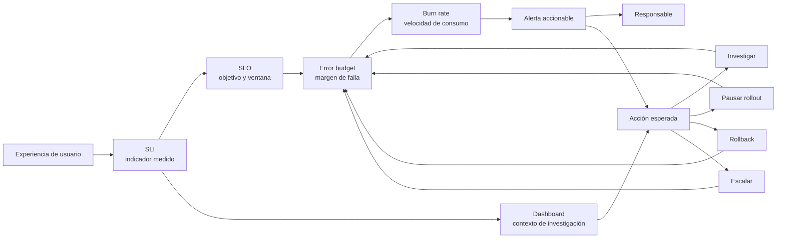

# Alertas, SLOs y SLIs

> **Curso:** DevOps · **Capítulo:** 08 · **Prerrequisitos:** Observabilidad
> **Código:** [`src/reliability_targets.rs`](../src/reliability_targets.rs) · **Video:** pendiente
> **Lección en el sitio:** pendiente

## Estado

`implemented`

## Intención

Este capítulo enseñará a definir señales confiables: SLIs, SLOs, error budgets,
alertas accionables y reducción de fatiga de alertas.

La idea central es que confiabilidad no se mide por intuición ni por cantidad de
dashboards. Se mide eligiendo una señal que represente experiencia de usuario,
un objetivo explícito, una ventana de evaluación y una acción humana razonable
cuando el sistema se aleja de lo prometido.

Una alerta seria no existe para avisar que "algo cambió". Existe para pedir una
decisión: investigar, pausar un rollout, revertir, escalar o aceptar consumo de
presupuesto de error.

## Problema

Una alerta que no exige una acción clara entrena al equipo a ignorarla. Medir
confiabilidad exige elegir qué afecta al usuario, qué umbral importa y cuándo
vale la pena despertar a alguien.

El problema real aparece cuando un sistema tiene observabilidad, pero no tiene
criterio de confiabilidad. Hay métricas de CPU, latencia promedio, conteos de
errores y paneles bonitos, pero nadie sabe si el usuario está bien servido. El
equipo recibe alertas por síntomas técnicos que no requieren acción inmediata y
termina ignorando incluso las señales importantes.

Sin SLIs, el equipo discute opiniones. Sin SLOs, no hay una promesa explícita.
Sin error budget, cada incidente se siente igual de urgente. Sin alertas
accionables, la guardia se desgasta y la operación pierde confianza.

## Concepto

Un **SLI** es un indicador de nivel de servicio: una medición que aproxima una
parte importante de la experiencia del usuario. Ejemplos: porcentaje de
peticiones exitosas, latencia bajo cierto umbral, frescura de datos o
disponibilidad de una operación crítica.

Un **SLO** es un objetivo de nivel de servicio: una meta explícita para un SLI
durante una ventana de tiempo. Por ejemplo: "99.9% de las peticiones de
checkout deben responder correctamente en 30 días".

Un **error budget** es el margen de falla que el SLO permite. Si el SLO es
99.9%, el presupuesto de error es 0.1%. Ese presupuesto ayuda a equilibrar
velocidad de cambio y confiabilidad: si se consume rápido, conviene reducir
riesgo; si se conserva, el equipo puede moverse con más confianza.

Una **alerta accionable** conecta una condición con una respuesta concreta. No
debe depender solo de que una métrica cruzó un número; debe indicar por qué
importa, qué servicio afecta, qué tan rápido se está consumiendo el presupuesto
y qué acción se espera.

## Alternativas

| Enfoque | Ventaja | Riesgo |
|---------|---------|--------|
| Alertar por infraestructura | Fácil de configurar con CPU, memoria o disco. | Puede despertar al equipo sin impacto real de usuario. |
| Alertar por errores absolutos | Simple de entender al inicio. | No distingue tráfico bajo, alto, ruido o ventanas relevantes. |
| Alertar por dashboards manuales | Útil para investigación y contexto. | Depende de que alguien esté mirando la pantalla. |
| SLOs por experiencia de usuario | Alinea operación con impacto real. | Exige elegir bien el SLI y revisar el objetivo con criterio. |
| Error budget con burn rate | Muestra velocidad de deterioro y urgencia. | Requiere entender ventanas, tolerancia y respuesta operativa. |

Este capítulo usa SLI, SLO, presupuesto de error y burn rate porque obligan a
separar síntoma, impacto y acción. No eliminan juicio humano; lo enfocan.

## Tradeoffs

Un SLO demasiado estricto puede frenar cambios útiles o generar alertas
constantes. Un SLO demasiado laxo puede ocultar daño real. La meta no es sonar
ambicioso, sino representar una promesa que el usuario nota y el equipo puede
sostener.

Un SLI muy técnico puede ser barato de medir, pero pobre para decidir. CPU alta
no siempre significa usuario afectado. Un SLI muy cercano al negocio puede ser
más útil, pero también requerir instrumentación cuidadosa y acuerdos de
producto.

Alertar temprano reduce tiempo de reacción, pero aumenta ruido. Alertar tarde
reduce fatiga, pero puede llegar cuando el presupuesto ya se consumió. Por eso
las ventanas de burn rate importan: una alerta de consumo rápido no significa lo
mismo que una degradación lenta.

## Invariantes

Un objetivo de confiabilidad útil conserva estas invariantes:

- el SLI representa una experiencia relevante para el usuario;
- el SLO tiene porcentaje y ventana explícitos;
- el error budget se deriva del SLO, no se inventa aparte;
- la alerta declara acción humana esperada;
- la severidad depende de impacto y velocidad de consumo;
- una alerta sin dueño no debe existir;
- los dashboards acompañan la investigación, pero no sustituyen el criterio de
  alerta;
- ningún capítulo, script o automatización marca este material como `reviewed`
  ni `published`.

## Fronteras con cursos vecinos

Observabilidad enseña a producir señales con contexto. Este capítulo decide qué
señales representan confiabilidad y cuándo deben activar una respuesta.

Stack Grafana enseña una tubería concreta para métricas, logs y trazas. Este
capítulo puede usar esas señales, pero no enseña instalación ni administración
del stack.

`rust-cloud` enseña plataformas donde corren los sistemas. Este capítulo no
repite servicios administrados, balanceadores ni regiones, salvo cuando ayudan a
explicar impacto de usuario.

SRE profundiza en operación de confiabilidad a escala. Este capítulo prepara el
lenguaje base para discutir SLOs, error budgets y alertas sin convertir DevOps
en una lista de alarmas.

## Diagrama

El diagrama principal vive en
[`diagrams/08-alertas-slos-y-slis.mmd`](../diagrams/08-alertas-slos-y-slis.mmd).



El flujo empieza en experiencia de usuario, no en CPU. El SLI aproxima esa
experiencia; el SLO fija una promesa durante una ventana; el presupuesto de
error convierte la promesa en margen operativo; el burn rate indica urgencia;
la alerta pide una acción concreta.

## Cómo leer un SLO operativo

Una frase útil de SLO tiene esta forma:

> Durante una ventana concreta, una proporción mínima de operaciones relevantes
> debe cumplir una condición que el usuario nota.

Por ejemplo: "en 30 días, 99.9% de los checkouts deben terminar correctamente".

Esa frase deja varias preguntas abiertas que el equipo debe responder:

- qué cuenta como checkout;
- qué significa correctamente;
- dónde se mide;
- qué eventos se excluyen;
- quién es dueño de la alerta;
- qué acción se toma si el presupuesto se quema rápido.

El objetivo no es escribir una frase bonita. El objetivo es construir un contrato
que el equipo pueda medir, discutir y operar.

## Implementación

El código vive en
[`src/reliability_targets.rs`](../src/reliability_targets.rs). El módulo
representa:

- `SliKind`: disponibilidad, latencia, frescura o corrección;
- `ServiceLevelIndicator`: indicador con eventos buenos y totales;
- `ServiceLevelObjective`: objetivo con porcentaje y ventana;
- `AlertPolicy`: dueño, acción, burn rate e interrupción humana;
- `ReliabilityFinding`: hallazgos del diseño operativo;
- `evaluate_reliability`: evaluación del SLO y su alerta.

La implementación no consulta un sistema real de métricas. Eso es deliberado:
primero se aprende a razonar sobre el contrato de confiabilidad; después se
conecta a Prometheus, Grafana, OpenTelemetry u otra plataforma.

## Ejemplo ejecutable

El ejemplo vive en
[`examples/reliability_targets.rs`](../examples/reliability_targets.rs):

```bash
cargo run --example reliability_targets
```

El ejemplo compara:

- un SLO de checkout con presupuesto disponible, dueño y acción concreta;
- un SLO con presupuesto agotado y una alerta sin dueño ni acción.

La diferencia importante no es el número por sí mismo. La diferencia es si el
equipo sabe qué hacer cuando la señal cruza el umbral.

## Pruebas

Las pruebas unitarias cubren:

- SLO sano con presupuesto restante y alerta accionable;
- presupuesto de error agotado;
- alerta con burn rate rápido, pero sin dueño, acción o página humana;
- mediciones inválidas y objetivos fuera de rango.

Los doctests muestran cómo crear un SLI y cómo evaluar un SLO completo.

## Análisis de complejidad

El modelo educativo usa operaciones constantes: calcula porcentajes y revisa
invariantes de una sola política. Su costo local es `O(1)`.

En producción, el costo real está en otro lugar:

- volumen de eventos usados para construir el SLI;
- precisión de las ventanas de evaluación;
- costo de consultas por burn rate;
- frecuencia de alertas;
- tiempo humano perdido por ruido;
- costo de no alertar cuando el usuario sí está afectado.

El modelo local no pretende simular Prometheus ni un sistema de alertas real.
Su función es sostener la pregunta de ingeniería: ¿esta alerta representa daño
de usuario y pide una acción razonable?

## Cierre editorial

Este capítulo queda en estado `implemented`: tiene concepto, problema,
alternativas, invariantes, modelo Rust, ejemplo ejecutable y diagrama. Todavía
no está `reviewed` ni `published`. La revisión humana de Joel sigue siendo la
frontera para aprobarlo editorialmente.
