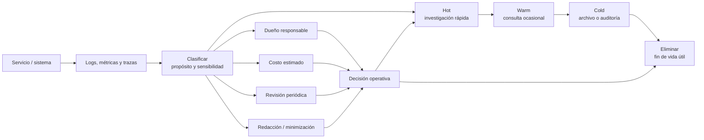

# Retención de Telemetría

> **Curso:** DevOps · **Capítulo:** 09 · **Prerrequisitos:** Stack Grafana
> **Código:** [`src/telemetry_retention.rs`](../src/telemetry_retention.rs) · **Video:** pendiente
> **Lección en el sitio:** pendiente

## Estado

`implemented`

## Intención

Este capítulo enseña a diseñar políticas de retención para logs, métricas y
trazas. La pregunta central no es "¿cuánto podemos guardar?", sino "¿qué
evidencia necesitamos conservar, durante cuánto tiempo y a qué costo?".

La telemetría existe para investigar incidentes, auditar cambios, entender
tendencias y sostener decisiones operativas. Si se guarda sin intención, se
convierte en ruido caro. Si se borra demasiado pronto, el sistema pierde
memoria justo cuando más la necesita.

Retener bien significa clasificar señales por valor, frecuencia de consulta,
sensibilidad, costo, obligación regulatoria y vida útil. Hot, warm y cold no
son palabras de proveedor: son niveles de acceso y costo al servicio de una
decisión.

## Problema

Guardar toda la telemetría para siempre es caro; guardar demasiado poco vuelve
imposible investigar incidentes. La decisión correcta depende de valor
operativo, costo, cumplimiento y frecuencia de consulta.

El problema aparece cuando el equipo trata logs, métricas y trazas como si
tuvieran la misma vida útil. Una métrica agregada puede ser útil durante meses
para ver tendencia. Una traza completa puede ser valiosa durante días para
investigar un incidente reciente. Un log con datos sensibles puede exigir
retención mínima, redacción o eliminación temprana. Una señal regulatoria puede
necesitar conservarse más tiempo, pero con controles distintos.

Sin política explícita, la retención crece por inercia. El equipo conserva todo
porque teme perder evidencia, pero no sabe qué consulta realmente. Después,
cuando el costo sube o una auditoría pregunta por datos sensibles, nadie puede
explicar por qué esa telemetría existe, quién la usa o cuándo debe expirar.

## Concepto

Una política de retención define el ciclo de vida de una señal operativa:
ingesta, almacenamiento activo, degradación a almacenamiento más barato,
archivo, eliminación y revisión.

Los niveles más comunes son:

- **hot:** datos recientes, consultados con frecuencia y disponibles para
  investigación rápida;
- **warm:** datos menos recientes, consultables con más latencia o menor
  detalle;
- **cold:** archivo barato para auditoría, investigación excepcional o análisis
  histórico;
- **delete:** eliminación deliberada cuando el dato ya no tiene valor o ya no
  debe conservarse.

La política no solo declara días. También declara propósito, dueño, tipo de
señal, sensibilidad, agregación, muestreo, costo esperado y regla de revisión.

## Alternativas

| Enfoque | Ventaja | Riesgo |
|---------|---------|--------|
| Retención infinita | Evita decidir al inicio y conserva toda la evidencia. | Costo alto, riesgo de datos sensibles y búsquedas más ruidosas. |
| Retención mínima | Reduce costo y exposición. | Puede impedir investigar incidentes o tendencias. |
| Misma retención para todo | Fácil de explicar y automatizar. | Ignora que logs, métricas y trazas tienen valor y sensibilidad distintos. |
| Retención por proveedor | Aprovecha defaults y niveles administrados. | Puede ocultar costos, latencia de recuperación y obligaciones del dominio. |
| Retención por propósito | Alinea costo, investigación, auditoría y privacidad. | Exige clasificación inicial y revisión periódica. |

Este capítulo usa retención por propósito porque obliga a conectar cada señal
con una pregunta operativa. No se trata de guardar menos por ahorrar, ni de
guardar más por ansiedad. Se trata de conservar evidencia útil y eliminar datos
cuando ya no aportan valor.

## Tradeoffs

Más retención mejora la capacidad de mirar hacia atrás, pero aumenta costo,
superficie de exposición y ruido. Menos retención simplifica operación, pero
puede dejar al equipo sin evidencia durante incidentes lentos, fraudes,
degradaciones graduales o auditorías.

Más detalle ayuda durante investigación, pero puede contener información
sensible o generar cardinalidad costosa. Agregar y muestrear reduce volumen,
aunque puede borrar la pista exacta que explica un caso raro.

Los niveles hot, warm y cold también cambian la ergonomía. Hot permite
preguntas rápidas durante una guardia. Warm puede servir para comparar semanas.
Cold puede ser suficiente para auditoría, pero no para decidir en medio de un
incidente.

## Invariantes

Una política de retención sana conserva estas invariantes:

- cada señal tiene propósito explícito;
- cada política tiene dueño responsable;
- cada tipo de telemetría declara nivel hot, warm, cold o eliminación;
- los días de retención se justifican por investigación, auditoría,
  cumplimiento o tendencia;
- los datos sensibles se minimizan, redactan o eliminan antes de volverse
  deuda;
- el costo esperado se estima antes de aumentar volumen o duración;
- la recuperación desde cold se considera parte de la política, no un detalle
  posterior;
- la política se revisa cuando cambian el producto, el tráfico, la regulación o
  el costo;
- ningún capítulo, script o automatización marca este material como `reviewed`
  ni `published`.

## Fronteras con cursos vecinos

Stack Grafana enseña a enrutar métricas, logs y trazas hacia backends
concretos. Este capítulo decide cuánto tiempo viven esas señales y con qué
nivel de acceso.

Alertas, SLOs y SLIs decide qué señales activan una respuesta humana. Este
capítulo conserva la evidencia que permite explicar por qué una alerta ocurrió
y qué pasó después.

`rust-cloud` enseña servicios administrados de almacenamiento, observabilidad y
archivo. Este capítulo no compara proveedores; enseña el contrato mental para
decidir retención antes de elegir una herramienta.

Operación en dominios regulados profundiza en controles, auditoría y
cumplimiento. Este capítulo prepara el lenguaje base para hablar de vida útil,
sensibilidad y eliminación con criterio.

## Entregables del capítulo

- Capítulo completo conforme a RFC-0001 §14.
- Diagrama de ciclo de vida de telemetría.
- Modelo Rust mínimo de política de retención.
- Ejemplos progresivos y pruebas.
- Benchmarks o estimaciones de costo documentadas.

## Diagrama

El diagrama principal vive en
[`diagrams/09-retencion-de-telemetria.mmd`](../diagrams/09-retencion-de-telemetria.mmd).



El flujo empieza cuando el sistema emite señales. Antes de decidir días, el
equipo clasifica propósito y sensibilidad. Esa clasificación define cuánto vive
la señal en hot, cuándo pasa a warm, cuándo se archiva en cold y cuándo se
elimina. Dueño, costo, revisión y privacidad no son columnas administrativas:
son parte del diseño operativo.

## Cómo leer una política de retención

Una política útil responde estas preguntas:

- qué señal se retiene;
- para qué se conserva;
- quién responde por ella;
- qué sensibilidad tiene;
- cuántos días vive en hot, warm y cold;
- cuánto volumen produce por día;
- cuándo se revisa;
- qué datos se redactan, agregan o eliminan.

Una política pobre solo dice "guardar logs por 90 días". Una política operable
explica por qué esos logs existen, qué pregunta responden, cuánto cuestan, qué
riesgo contienen y cuándo deben dejar de vivir.

## Implementación

El código vive en
[`src/telemetry_retention.rs`](../src/telemetry_retention.rs). El módulo
representa:

- `TelemetrySignalKind`: métrica, log o traza;
- `DataSensitivity`: datos públicos, internos, sensibles o regulados;
- `RetentionPurpose`: investigación, tendencia, auditoría o cumplimiento;
- `RetentionTier`: días hot, warm y cold;
- `TelemetryRetentionPolicy`: política completa de vida útil;
- `TelemetryRetentionFinding`: hallazgos de diseño;
- `evaluate_retention`: evaluación de costo, sensibilidad y gobernanza.

La implementación no consulta un proveedor real ni calcula facturas exactas.
Primero modela la decisión: qué señal se guarda, por qué, quién responde por
ella, cuánto volumen produce y cuándo debe revisarse.

## Ejemplo ejecutable

El ejemplo vive en
[`examples/telemetry_retention.rs`](../examples/telemetry_retention.rs):

```bash
cargo run --example telemetry_retention
```

El ejemplo compara:

- una política de métricas de checkout con propósito de tendencia, dueño,
  retención hot/warm/cold, volumen estimado y revisión periódica;
- una política riesgosa de logs sensibles con demasiados días hot y sin
  redacción de campos sensibles.

La diferencia importante no está en memorizar un número de días. La diferencia
es si el equipo puede explicar valor, costo, sensibilidad y vida útil de la
señal.

## Pruebas

Las pruebas unitarias cubren:

- política de métrica con propósito, dueño, revisión y costo acotado;
- logs sensibles sin redacción;
- política sin dueño, propósito ni revisión;
- volumen inválido y datos regulados sin archivo cold.

Los doctests muestran cómo crear una política mínima y cómo evaluar una
política completa.

## Análisis de complejidad

El modelo educativo evalúa una sola política con costo constante: `O(1)`.
Calcula días totales, volumen estimado y hallazgos sobre campos ya declarados.

En producción, el costo real vive en otra parte:

- volumen diario por servicio y ambiente;
- cardinalidad de métricas;
- tamaño y estructura de logs;
- porcentaje de trazas muestreadas;
- compresión y formato de almacenamiento;
- latencia de recuperación desde cold;
- frecuencia de consultas durante incidentes;
- obligaciones de privacidad, auditoría y eliminación.

Por eso el capítulo separa modelo local de plataforma real. La función Rust
protege el contrato educativo; la operación real exige medir volumen, costo y
uso en el sistema desplegado.

## Cierre editorial

Este capítulo queda en estado `implemented`: define intención, problema,
concepto, alternativas, tradeoffs, invariantes, fronteras, modelo Rust mínimo,
pruebas, ejemplo ejecutable, diagrama y análisis de complejidad. Todavía no
tiene ejercicios, soluciones ni benchmark educativo. Tampoco está `reviewed` ni
`published`; la revisión humana de Joel sigue siendo la frontera editorial.
