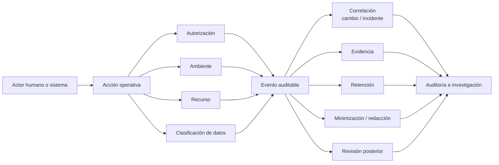

# Operación en dominios regulados

> **Curso:** DevOps · **Capítulo:** 10 · **Prerrequisitos:** Observabilidad, releases y retención
> **Código:** [`src/regulated_operations.rs`](../src/regulated_operations.rs) · **Video:** pendiente
> **Lección en el sitio:** pendiente

## Estado

`benchmarked`

## Intención

Este capítulo aplicará DevOps a dominios regulados: trazabilidad de
transacciones, auditoría, gestión de secretos, cumplimiento, segregación de
ambientes y respuesta a incidentes.

La idea central es que un sistema regulado no solo debe operar: debe poder
explicar su operación. Cada cambio relevante necesita identidad, autorización,
propósito, ambiente, evidencia y una forma razonable de reconstruir lo ocurrido
sin exponer más datos de los necesarios.

Regulación no significa burocracia por reflejo. Significa que ciertas decisiones
tienen impacto legal, financiero, médico, fiscal, contractual o de seguridad.
El trabajo de DevOps es sostener velocidad con controles verificables, no
esconder riesgo detrás de procesos manuales.

## Problema

En dominios sensibles no basta con que el sistema funcione. Debe explicar qué
ocurrió, quién cambió qué, con qué autorización, qué datos fueron afectados y
cómo se recupera evidencia sin romper privacidad ni seguridad.

El problema real aparece cuando un equipo adopta prácticas de entrega rápida sin
conservar trazabilidad suficiente. El pipeline despliega, los servicios emiten
logs, las métricas se ven sanas y los incidentes se atienden, pero una auditoría
pregunta algo incómodo: ¿quién autorizó este cambio?, ¿qué ambiente tocó?,
¿qué datos de clientes pudo afectar?, ¿dónde está la evidencia?, ¿quién revisó
la excepción?

Sin trazabilidad, una operación correcta puede volverse indefendible. Sin
segregación de ambientes, un acceso temporal puede convertirse en riesgo
permanente. Sin manejo disciplinado de secretos, una emergencia puede dejar una
puerta abierta. Sin retención y redacción, la evidencia puede violar privacidad.

El reto es diseñar controles que no destruyan la operabilidad. Un control que
solo existe en una hoja de cálculo y se ignora durante incidentes no protege al
sistema. Un control integrado al flujo de cambios, observabilidad y respuesta
puede reducir riesgo sin paralizar al equipo.

## Concepto

Operar en dominios regulados significa hacer explícitas cuatro preguntas:

- **identidad:** quién o qué actor realizó una acción;
- **autorización:** por qué tenía permiso para hacerla;
- **alcance:** qué ambiente, servicio, recurso o dato pudo afectar;
- **evidencia:** cómo se reconstruye la acción después sin exponer de más.

Un evento auditable no es cualquier log. Es una pieza de evidencia con
estructura suficiente para responder preguntas posteriores. Debe conectar actor,
acción, recurso, ambiente, autorización, correlación, clasificación de datos,
resultado y retención.

La operación regulada también exige separar ambientes. Desarrollo, pruebas,
staging y producción no son etiquetas decorativas: determinan acceso, datos,
aprobaciones, secretos, retención, monitoreo y severidad de incidentes.

## Alternativas

| Enfoque | Ventaja | Riesgo |
|---------|---------|--------|
| Controles manuales externos | Fácil de iniciar con listas de aprobación. | Se vuelven lentos, incompletos y difíciles de verificar. |
| Bloquear todos los cambios | Reduce riesgo inmediato. | Rompe capacidad de respuesta y empuja cambios fuera del proceso. |
| Auditar solo incidentes | Menos volumen de evidencia. | Llega tarde y pierde contexto previo al incidente. |
| Automatizar sin revisión | Mantiene velocidad. | Puede desplegar cambios sensibles sin criterio humano. |
| Controles integrados al flujo DevOps | Une velocidad, evidencia y revisión. | Exige diseño cuidadoso de eventos, permisos y excepciones. |

Este capítulo usa controles integrados porque DevOps en dominios regulados debe
ser verificable durante la operación normal, no solo durante auditorías. La meta
no es llenar formatos: es que el sistema pueda responder por sus actos.

## Tradeoffs

Más evidencia mejora auditoría, pero puede aumentar exposición de datos
sensibles. Menos evidencia reduce riesgo de privacidad, pero puede impedir
reconstruir un incidente. La respuesta no es guardar todo ni borrar todo: es
guardar lo necesario con redacción, propósito y retención explícita.

Más aprobaciones reducen cambios accidentales, pero pueden hacer lenta la
respuesta a incidentes. Menos aprobaciones aceleran, pero pueden permitir
acciones sin revisión en producción. Por eso las excepciones deben ser
temporales, registradas y revisables.

Más segregación protege ambientes, pero aumenta complejidad operativa. Menos
segregación simplifica, pero mezcla datos, permisos y riesgos. La frontera
importante es producción y cualquier ambiente con datos reales o equivalentes.

## Invariantes

Una operación regulada sana conserva estas invariantes:

- cada acción sensible tiene actor identificable;
- cada cambio relevante tiene autorización o excepción explícita;
- cada evento auditable declara ambiente, recurso y acción;
- los secretos no se registran ni viajan por canales no autorizados;
- producción se separa de ambientes no productivos;
- los datos sensibles se minimizan, redactan o clasifican;
- la evidencia conserva correlación suficiente para investigación;
- las excepciones tienen duración, dueño y revisión posterior;
- la retención de evidencia se alinea con privacidad y cumplimiento;
- ningún capítulo, script o automatización marca este material como `reviewed`
  ni `published`.

## Fronteras con cursos vecinos

Gestión de releases enseña cómo planear, comunicar y ejecutar cambios. Este
capítulo agrega la pregunta regulada: qué evidencia demuestra que el cambio fue
autorizado y acotado.

Observabilidad enseña a leer sistemas vivos. Este capítulo decide qué señales
se convierten en evidencia auditable y cuáles solo sirven para diagnóstico.

Retención de telemetría enseña vida útil, costo y sensibilidad de señales. Este
capítulo usa esa base para conservar evidencia sin romper privacidad.

`rust-security` profundiza en amenazas, controles técnicos y secretos. Este
capítulo no reemplaza seguridad; muestra cómo DevOps debe operar respetando
controles de seguridad.

`software-engineering-handbook` puede tratar gobernanza organizacional. Este
capítulo se mantiene en el contrato técnico-operativo: eventos, cambios,
ambientes, secretos, evidencias y respuesta.

## Entregables del capítulo

- Capítulo completo conforme a RFC-0001 §14.
- Diagrama de auditoría y trazabilidad.
- Modelo Rust mínimo de evento auditable.
- Ejemplos progresivos y pruebas.
- Benchmarks, métricas o justificación explícita de no aplicabilidad.

## Diagrama

El diagrama principal vive en
[`diagrams/10-operacion-en-dominios-regulados.mmd`](../diagrams/10-operacion-en-dominios-regulados.mmd).



La ruta empieza con una acción operativa. Para que esa acción sea defendible,
necesita autorización, ambiente, recurso y clasificación de datos. Todo eso se
concentra en un evento auditable que luego alimenta investigación, auditoría y
revisión posterior.

## Cómo leer un evento auditable

Un evento auditable útil responde:

- quién actuó;
- qué hizo;
- sobre qué recurso;
- en qué ambiente;
- con qué autorización;
- qué datos pudo afectar;
- con qué cambio o incidente se correlaciona;
- dónde vive la evidencia;
- cuánto tiempo se conserva;
- qué datos se minimizan o redactan.

Un log que solo dice "deploy ok" no alcanza. En un dominio regulado, el evento
debe conectar acción y responsabilidad. La operación no se vuelve más seria por
tener más texto; se vuelve más seria cuando la evidencia permite reconstruir una
decisión sin exponer información innecesaria.

## Implementación

El código vive en
[`src/regulated_operations.rs`](../src/regulated_operations.rs). El módulo
representa:

- `Environment`: desarrollo, pruebas, staging o producción;
- `DataClassification`: datos públicos, internos, sensibles o regulados;
- `AuthorizationKind`: aprobación humana, automatización, emergencia o
  excepción temporal;
- `RegulatedOperationEvent`: evento auditable;
- `RegulatedOperationFinding`: hallazgos operativos;
- `evaluate_regulated_operation`: evaluación de evidencia, autorización,
  ambiente y privacidad.

La implementación no pretende modelar leyes específicas. Primero enseña el
contrato operativo: cada acción sensible debe tener identidad, autorización,
alcance, evidencia y límites explícitos.

## Ejemplo ejecutable

El ejemplo vive en
[`examples/regulated_operations.rs`](../examples/regulated_operations.rs):

```bash
cargo run --example regulated_operations
```

El ejemplo compara:

- un despliegue productivo con aprobación humana, correlación, evidencia,
  minimización de datos y retención;
- una rotación de secreto durante emergencia sin revisión posterior.

La segunda operación puede ser necesaria durante un incidente, pero no queda
auditada correctamente hasta exigir revisión posterior. La emergencia justifica
velocidad, no ausencia de evidencia.

## Pruebas

Las pruebas unitarias cubren:

- evento productivo con autorización, correlación, evidencia y redacción;
- cambio productivo sin autorización explícita;
- emergencia sin revisión posterior;
- datos regulados sin minimización ni retención.

Los doctests muestran cómo crear un evento mínimo y cómo evaluar una operación
productiva auditable.

## Análisis de complejidad

El modelo educativo evalúa un evento con costo constante: `O(1)`. Revisa campos
de identidad, autorización, ambiente, evidencia, sensibilidad y retención sin
recorrer colecciones.

En producción, el costo real está en:

- volumen de eventos auditables;
- cardinalidad de actores, recursos y ambientes;
- almacenamiento de evidencia;
- búsqueda por correlación durante auditorías;
- retención por obligaciones del dominio;
- redacción o tokenización de datos sensibles;
- tiempo humano de revisión posterior;
- integración con IAM, pipelines, incidentes y registros de cambio.

Por eso el módulo Rust no pretende ser un SIEM ni un motor de cumplimiento. Su
función es preservar la pregunta central: ¿esta acción puede explicarse después
con evidencia suficiente y exposición mínima?

## Benchmarks

El benchmark educativo vive en
[`benches/regulated_operations_baseline.rs`](../benches/regulated_operations_baseline.rs):

```bash
cargo bench --bench regulated_operations_baseline
```

Ese benchmark evalúa tres eventos educativos: un despliegue productivo
auditable, un despliegue productivo sin autorización y una emergencia sin
revisión posterior. No mide almacenamiento real, SIEM, IAM, latencia de
búsqueda, firma criptográfica, redacción automática ni procesos humanos.

En producción, las mediciones relevantes serían:

- eventos auditables por servicio, ambiente y actor;
- cambios productivos con autorización verificable;
- excepciones abiertas y tiempo hasta revisión posterior;
- eventos con datos sensibles minimizados o redactados;
- tiempo para reconstruir una acción durante auditoría;
- evidencia sin correlación con cambio o incidente;
- secretos rotados por emergencia;
- hallazgos repetidos por pipeline, equipo o ambiente.

La regla práctica: el benchmark local solo protege el contrato educativo. La
operación regulada real requiere evidencia persistente, controles de acceso,
retención, revisión humana y trazabilidad entre sistemas.

## Ejercicios

### Nivel 1: despliegue productivo auditable

Construye un evento para desplegar `payments-api` en producción con aprobación
humana, clasificación sensible, correlación con cambio, evidencia, minimización
de datos y retención de 365 días.

Objetivo: explicar por qué el evento puede responder quién, qué, dónde, con qué
autorización y con qué evidencia.

### Nivel 2: producción sin autorización

Construye un despliegue productivo con correlación, evidencia y retención, pero
sin autorización. Evalúa el hallazgo y luego corrige el evento con una
automatización aprobada.

Objetivo: distinguir una acción técnicamente exitosa de una acción defendible.

### Nivel 3: emergencia con revisión posterior

Construye una rotación de secreto durante emergencia con evidencia, correlación
y retención, pero sin revisión posterior. Evalúa el hallazgo y luego corrige el
evento exigiendo revisión posterior.

Objetivo: entender que la emergencia puede justificar velocidad, pero no borra
la responsabilidad de explicar la acción después.

### Nivel 4: caso real guiado

Diseña un evento auditable para una operación real o plausible de
Jeresoft/Softrek. Declara actor, acción, recurso, ambiente, clasificación,
autorización, correlación, evidencia, minimización, retención y revisión.

Objetivo: convertir un cambio operativo en evidencia útil para auditoría e
investigación sin exponer más datos de los necesarios.

## Soluciones

- Nivel 1:
  [`examples/soluciones/regulated_operations_nivel_1.rs`](../examples/soluciones/regulated_operations_nivel_1.rs)
- Nivel 2:
  [`examples/soluciones/regulated_operations_nivel_2.rs`](../examples/soluciones/regulated_operations_nivel_2.rs)
- Nivel 3:
  [`examples/soluciones/regulated_operations_nivel_3.rs`](../examples/soluciones/regulated_operations_nivel_3.rs)

El nivel 4 queda sin solución cerrada porque debe adaptarse a la operación
elegida por el estudiante.

## Referencias

- Google SRE Book: managing incidents and postmortems.
- NIST Cybersecurity Framework: identify, protect, detect, respond and recover.
- OWASP: logging, monitoring and secrets management practices.
- OpenTelemetry documentation: traces, logs and context propagation.
- Grafana documentation: audit logs and operational evidence.

## Cierre editorial

Este capítulo queda en estado `benchmarked`: define intención, problema,
concepto, alternativas, tradeoffs, invariantes, fronteras, modelo Rust mínimo y
pruebas, ejemplo ejecutable, diagrama, análisis de complejidad, ejercicios,
soluciones y benchmark educativo. Todavía no está `reviewed` ni `published`; la
revisión humana de Joel sigue siendo la frontera editorial.

---

[Anterior: 09. Retención de telemetría](09-retencion-de-telemetria.md)
